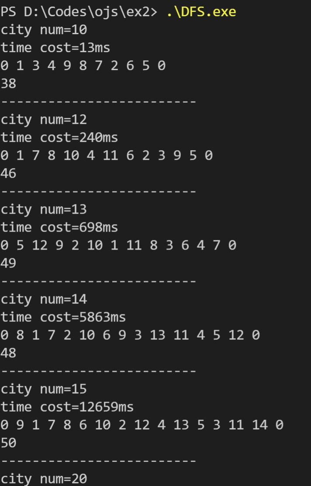
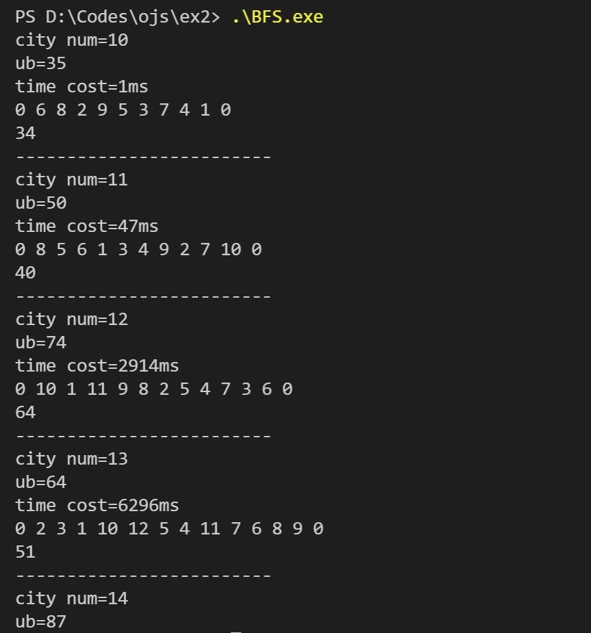

# 实验二 回溯法VS分支定界法

### 姓名：梁芮槐     学号：2019302789   班级：14011907

### 一、问题描述

回溯法可以处理货郎担问题，分支定界法也可以处理货郎担问题，回溯法和分支定界法哪个算法处理货郎担问题效率更高呢？

​	实现回溯法、分支定界法，以及不同的界值函数（课上讲过的或者自己新设计的），通过随机产生10个不同规模的算例（城市数量分别为10，20，40，80，100，120，160，180，200，500，或者其它规模），比较回溯法和分支定界法在相同界值函数下的执行效率。另外，分别比较回溯法和分支定界法在不同界值函数下的执行效率。（说明：本次实验课内容较多，算两次实验，这次做不完，下次继续。另外，如果想增加难度，可以参考以下两篇文章的实现Luo J C, Zhou M C Wang J Q. AB&B: An Anytime Branch and Bound Algorithm for Scheduling of Deadlock-prone Flexible Manufacturing Systems. *[IEEE Transactions on Automation Science and Engineering](https://ieeexplore.ieee.org/xpl/RecentIssue.jsp?punumber=8856)*, 18(2021)4, 2011-2021（循环深度优先）. **J. C. Luo**, K. Y. Xing, M. C. Zhou, X. L. Li and X. N. Wang, Deadlock-free scheduling of automated manufacturing systems using Petri nets and hybrid heuristic search, IEEE Trans. Syst., Man, Cybern., Syst., vol. 45, no. 3, pp. 530-541, 2015. （加动态窗口））

### 二、实验目的及要求

1. 理解回溯法和分支定界算法，并实现回溯法和分支定界法算法；

2. 掌握不同的界值设计方法，通过随机案例，比较界值设计的好坏；

3. 比较回溯法和分支定界法的执行效率，分析回溯法和分支定界法的优缺点。

### 三、算法伪代码或流程图

**DFS**：

```flow
st=>start: 随机生成n个城市的图
op1=>operation: 遍历城市，找到下一个未到达的城市加入curPath，更新当前花费
cond5=>condition: 是否已遍历完？
op2=>operation: 遍历未到达过的城市选择每行最小值求和计算当前下界LB(curCity, curReached)
cond1=>condition: 当前花费加上当前下界是否已超过当前bestCost？
cond2=>condition: 花费是否已超过当前bestCost？
cond3=>condition: 是否已到达最后一座城市？
op3=>operation: 计算当前完结路径后的总花费
cond4=>condition: 新的总花费是否小于当前bestCost?
op4=>operation: 更新当前bestCost和bestPath


e=>end: 输出最终解

st->op1->op2->cond1
cond1(yes)->op1
cond1(no)->cond2
cond2(yes)->op1
cond2(no)->cond3
cond3(yes)->op3->cond4
cond3(no)->op1
cond4(yes)->op4->cond5
cond4(no)->op1
cond5(yes)->e
cond5(no)->op1
```

**BFS**：

```flow
st=>start: 随机生成n个城市的图
op1=>operation: 贪心计算上界ub
op2=>operation: 将除起点外的所有城市生成节点，加入活结点列表lives
op3=>operation: 计算活结点下界（即剩余所有城市每行最小两个值之和除二向上取整之后的和）
cond1=>condition: 活结点列表是否为空？
op5=>operation: 以活结点列表第一个（优先级最高）为扩展节点
op6=>operation: 遍历当前扩展结点的下一个节点，计算新的花费和新节点的下界
cond2=>condition: 当前花费是否已超过上界ub？
cond3=>condition: 当前是否是最后一个城市？
cond4=>condition: 新的总花费是否小于当前bestCost?
op7=>operation: 更新bestCost和bestPath
op8=>operation: 将当前节点加入活结点列表
op9=>operation: 计算新的活结点下界（即剩余所有城市每行最小两个值之和除二向上取整之后的和）
op10=>operation: 依据下界排序活结点，越小越优先

e=>end: 输出最终解

st->op1->op2->op3->cond1
cond1(yes)->e
cond1(no)->op5->op6->cond2
cond2(yes)->cond1
cond2(no)->cond3
cond3(yes)->cond4
cond3(no)->op8->op9->op10->cond1
cond4(yes)->op7->cond1
cond4(no)->cond1

```


### 四．算法时间复杂性分析

​	DFS和BFS虽然剪枝和节点选择方法不同，但是最坏情况下的状态数量都是相同的，故时间复杂度为$O(n!)$。

### 五．实验结果与分析



回溯法运行到20个城市时已经需要很长的耗时。



分支限界法运行到14个城市时耗时就已经很长。


同样的测试数据，对比两种算法的运行效率，BFS明显比DFS耗时长。

### 六．问题思考与总结

​	虽然很多情况下分支限界法剪枝要优于回溯法不少，但是分支限界法进行动态的节点下界计算比回溯法下界要复杂一点，同时还多出了依据下界对节点进行排序（我用的快排$O(nlogn)$，用堆为$O(size)$）取最优来扩展的一个操作，另外还要求了更大的空间复杂度。

​	由此，根据当前上下界取法，分支限界法在小规模问题下并不能比回溯法更高效；而对于特大规模问题，理论上分支限界法会比回溯法运行的更快，但大规模问题就会要求大规模的空间来保存节点列表，现实上是不可行的。