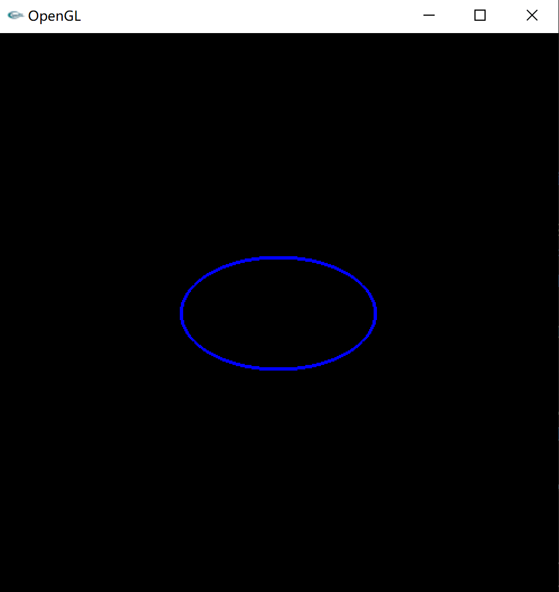
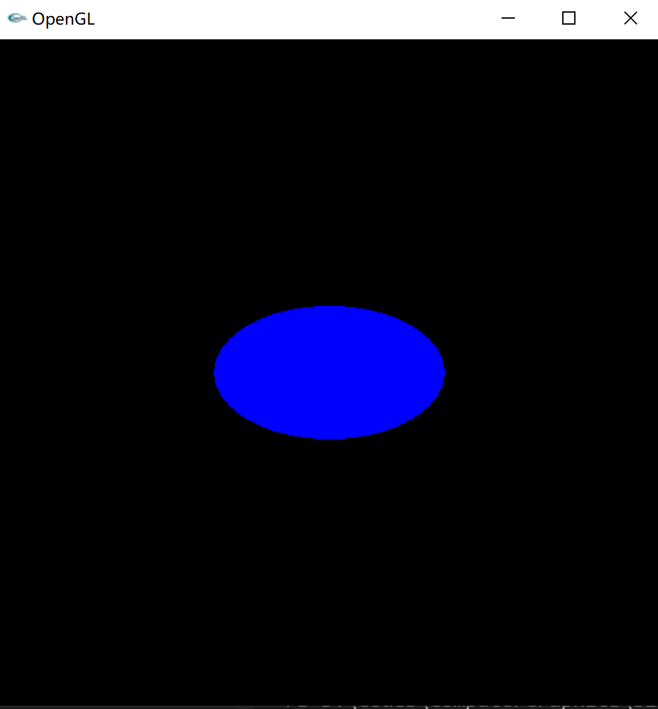

## 计算机图形学 第一次实验

#### 1、 练习使用GDI函数绘出基本几何元素，如点、线、矩形、圆、椭圆、多边形、圆弧等、并能够用颜色填充

主要代码`GDIPaint.cpp`：

```c++
void Paint(HWND hwnd)
{
    // paint struct 绘图结构体，存储目标窗口可以绘图的客户端区域(client area)
    PAINTSTRUCT ps;
    HDC hdc;   // DC(可画图的内存对象) 的句柄
    HPEN hpen; // 画笔

    // 通过窗口句柄获取该窗口的 DC
    hdc = BeginPaint(hwnd, &ps);

    // 创建普通画笔
    hpen = CreatePen(PS_SOLID, 3, RGB(255, 0, 0));
    // DC 选择画笔
    SelectObject(hdc, hpen);
    // 写文字
    SetTextColor(hdc, RGB(255, 0, 255));
    SetBkColor(hdc, RGB(0, 255, 0));
    SetBkMode(hdc, TRANSPARENT);
    TextOut(hdc, 502, 502, "Here is a green point!", 22);
    // 一个红色的点
    SetPixel(hdc, 500, 500, RGB(0, 255, 0));
    SetPixel(hdc, 501, 500, RGB(0, 255, 0));
    SetPixel(hdc, 500, 501, RGB(0, 255, 0));
    SetPixel(hdc, 501, 501, RGB(0, 255, 0));

    // 画线
    TextOut(hdc, 20, 20, "Line", 4);
    MoveToEx(hdc, 50, 50, NULL);
    LineTo(hdc, 50, 10);

    // 画圆弧
    static const float PI= 3.141592653;    // PI
    int R = 30;                            // 半径
    int n = 50;                            // 点数
    int centerX = 400, centerY = 400;      // 圆心
    float startAngle = 0.f, endAngle = PI; // 起始角度和终止角度

    TextOut(hdc, centerX, centerY, "arc", 3);
    MoveToEx(hdc, centerX + int(R * cos(startAngle)), centerY + int(R * sin(startAngle)), NULL);
    float x, y;
    float step = (endAngle - startAngle) / n;
    for(int i = 1; i <= n; i++)
    {
        LineTo(hdc, centerX + int(R * cos(step * i + startAngle)), centerY + int(R * sin(step * i + startAngle)));
    }

    // 六边形顶点
    TextOut(hdc, 440, 10, "six-edge polygon", 16);
    POINT gPoint[6] = {{420, 10}, {540, 140}, {600, 100}, {550, 200}, {380, 180}, {420, 10}};
    Polygon(hdc, gPoint, 6);
    // 画填充矩形 边框仍是画笔颜色
    TextOut(hdc, 30, 200, "solid rect", 10);
    RECT rect;
    rect.left = 100;
    rect.top = 200;
    rect.right = 200;
    rect.bottom = 300;
    FillRect(hdc, &rect, CreateSolidBrush(RGB(0, 0, 255)));
    // 画线框矩形
    TextOut(hdc, 30, 310, "frame rect", 10);
    rect.left = 100;
    rect.top = 310;
    rect.right = 200;
    rect.bottom = 410;
    FrameRect(hdc, &rect, CreateSolidBrush(RGB(255, 0, 0)));

    // 换填充笔刷
    HBRUSH bBrush = CreateSolidBrush(RGB(0, 0, 255));
    SelectObject(hdc, bBrush);
    // 画填充椭圆
    TextOut(hdc, 100, 130, "solid ellipse", 13);
    Ellipse(hdc, 100, 150, 50, 120);
    // 画填充圆
    TextOut(hdc, 100, 80, "solid circle", 12);
    Ellipse(hdc, 100, 100, 50, 50);

    TextOut(hdc, 230, 90, "solid rect", 10);
    Rectangle(hdc, 200, 90, 230, 120);        // 普通矩形
    TextOut(hdc, 270, 10, "solid round rect", 16);
    RoundRect(hdc, 200, 10, 270, 80, 25, 25); // 圆角矩形

    EndPaint(hwnd, &ps);
}
```


#### 2、练习使用GDI函数显示图像

第一项和第二项一起显示的效果：


#### 3、使用opengl函数写一个控制台程序，要求输出一些简单的二维图形：如线（实线、虚线）、四边形、多边形、圆、六面体、球、圆锥、茶壶等。

2D图像主要方法`GLDraw2D.pp`，==运行时右键切换模式==：

```c++
/**
 * 画点
 */
void drawPoint(void)
/**
 * 画线
 */
void drawLine(void);
/**
 * 画虚线
 */
void drawStippleLine(void);
/**
 * 画线框圆和椭圆
 */
void drawFrameEllipse(GLfloat centerX, GLfloat centerY, GLfloat rx, GLfloat ry);
/**
 * 画实体圆和椭圆
 */
void drawSolidEllipse(GLfloat centerX, GLfloat centerY, GLfloat rx, GLfloat ry);
/**
 * 画线框多边形
 */
void drawFramePolygon(void);
/**
 * 画实体多边形
 */
void drawSolidPolygon(void)
```


效果：







3D图像主要代码`GLDraw3D.cpp`，==运行时右键切换模式==：

```c++
void Display()
{
    glClear(GL_COLOR_BUFFER_BIT);
    glMatrixMode(GL_MODELVIEW);
    glLoadIdentity();
    glRotatef(xRot, 1, 0, 0);
    glRotatef(yRot, 0, 1, 0);
    switch (iMode)
    {
    case 1:
        glutWireTetrahedron();
        break;
    case 2:
        glutSolidTetrahedron();
        break;
    case 3:
        glutWireOctahedron();
        break;
    case 4:
        glutSolidOctahedron();
        break;
    case 5:
        glutWireSphere(1, 18, 18);
        break;
    case 6:
        glutSolidSphere(1, 18, 18);
        break;
    case 7:
        glutWireTeapot(1);
        break;
    case 8:
        glutSolidTeapot(1);
        break;
    case 9:
        gluSphere(obj, 1, 18, 18);
        break;
    case 10:
        gluCylinder(obj, 0.5, 0, 1, 18, 18);
        break;
    case 11:
        gluPartialDisk(obj, 0.3, 0.8, 18, 18, 30, 260);
        break;
    default:
        break;
    }
    glFlush();
}
```

,

效果：


