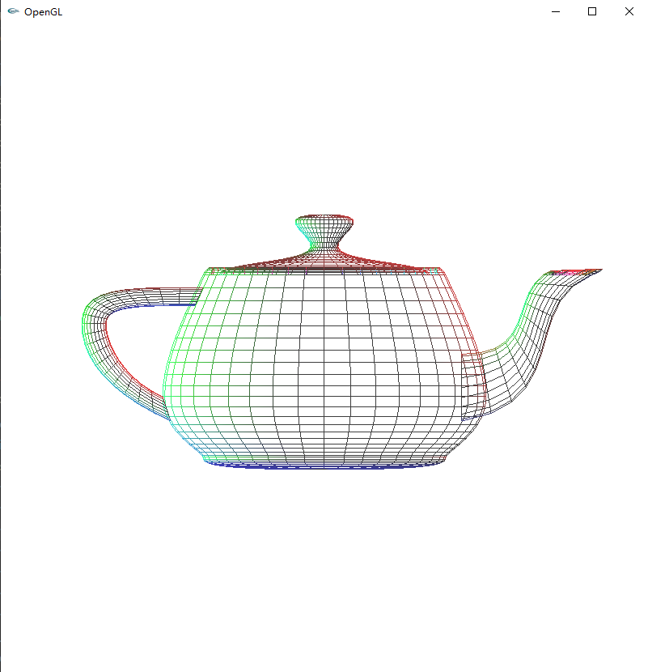

## 计算机图形学 第三次实验

### 1，使用opengl函数写一个程序，要求对于一个茶壶的左上四分之一部分进行显示，显示区位于屏幕的右下四分之一处

主要代码：

```c++
void ChangeSize(int w, int h)
{
    glViewport(w / 2, 0, w / 2, h / 2); // 设置观测区域
    glMatrixMode(GL_PROJECTION);
    glLoadIdentity();
    glOrtho(-1.5, 0, 0, 1.6, -1.5, 1.5); // 设置显示部分
}
```


### 2，使用opengl函数写一个图形程序，要求分别使用三个光源从一个茶壶的前右上方（偏红色），正左侧（偏绿色）和前左下方（偏蓝色）对于其进行照射，完成程序并观察效果

主要代码：

```c++
	GLfloat points[3][4] = {
        -2.0, 0, 0, 1,
        2.0, 2.0, 2.0, 1,
        -2.0, -2.0, 2.0, 1};

    GLfloat colors[3][4] = {
        0, 1.0, 0, 1,
        1.0, 0, 0, 1,
        0, 0, 1.0, 1};

    
    glLightfv(GL_LIGHT0, GL_DIFFUSE, colors[0]); // 两种光照属性叠加效果更好
    glLightfv(GL_LIGHT0, GL_AMBIENT, colors[0]);
    glLightfv(GL_LIGHT0, GL_POSITION, points[0]);
    glLightfv(GL_LIGHT1, GL_DIFFUSE, colors[1]);
    glLightfv(GL_LIGHT1, GL_AMBIENT, colors[1]);
    glLightfv(GL_LIGHT1, GL_POSITION, points[1]);
    glLightfv(GL_LIGHT2, GL_DIFFUSE, colors[2]);
    glLightfv(GL_LIGHT2, GL_AMBIENT, colors[2]);
    glLightfv(GL_LIGHT2, GL_POSITION, points[2]);
    
    glEnable(GL_LIGHTING);
    glEnable(GL_LIGHT0);
    glEnable(GL_LIGHT1);
    glEnable(GL_LIGHT2);
```




### 3，使用opengl函数完成一个图形动画程序，显示一个 球沿正弦曲线运动的过程，同时显示一个立方体沿抛物线运动过程

主要代码：

```c++
double xNsin = -0.6, xNpa = -0.6;
double yNsin = 0.6 * sin(6.0 * xNsin), yNpa = 0.9 - 0.5 * GRAVITY_FACTOR * (xNpa + 0.6) * (xNpa + 0.6);
///////////////////////////////////////////////
	if(xNsin >= 0.6)
        xNsin = -0.6;
    if(yNpa < 0)
        xNpa = -0.6;
    xNsin += 0.01;
    yNsin = 0.6 * sin(6.0 * xNsin);
    xNpa += 0.01;
    yNpa = 0.9 - 0.5 * GRAVITY_FACTOR * (xNpa + 0.6) * (xNpa + 0.6);
    Sleep(100);
    Display();
///////////////////////////////////////////////
	glTranslated(xNsin, yNsin, 0);
    glutWireSphere(0.1, 10, 10);
    glTranslated(-xNsin, -yNsin, 0); // 清空原先的平移矩阵
    glTranslated(xNpa, yNpa, 0);     // 设置新的平移矩阵
    glutWireCube(0.05);
```

