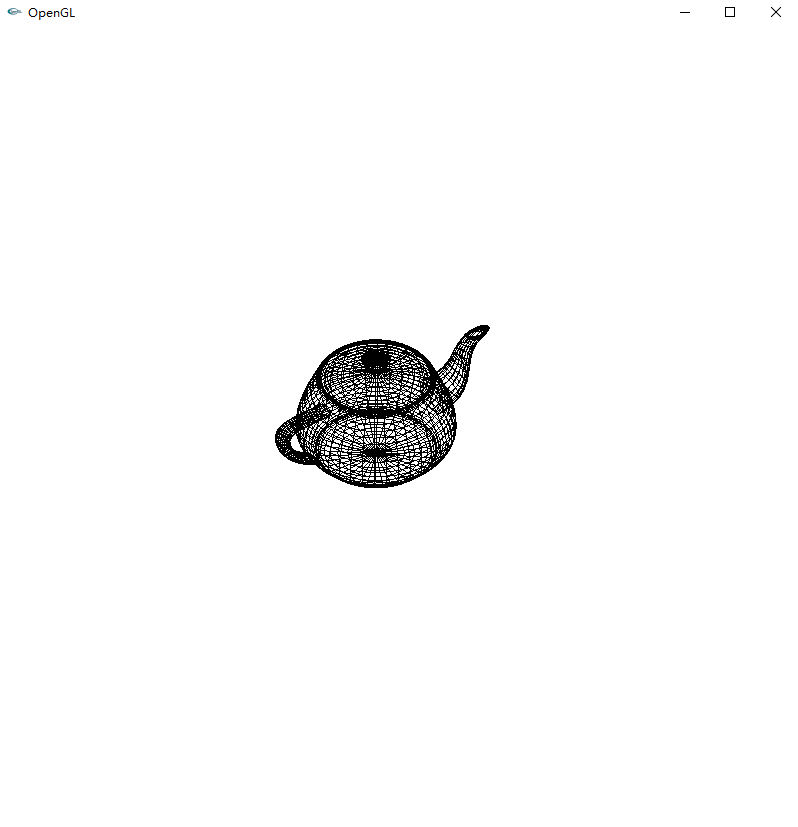
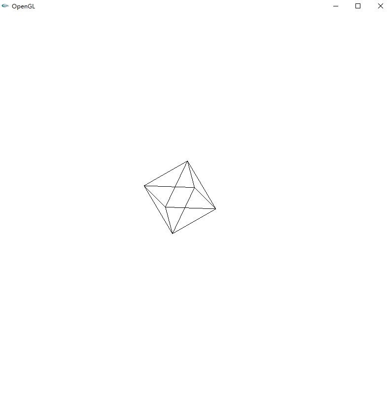
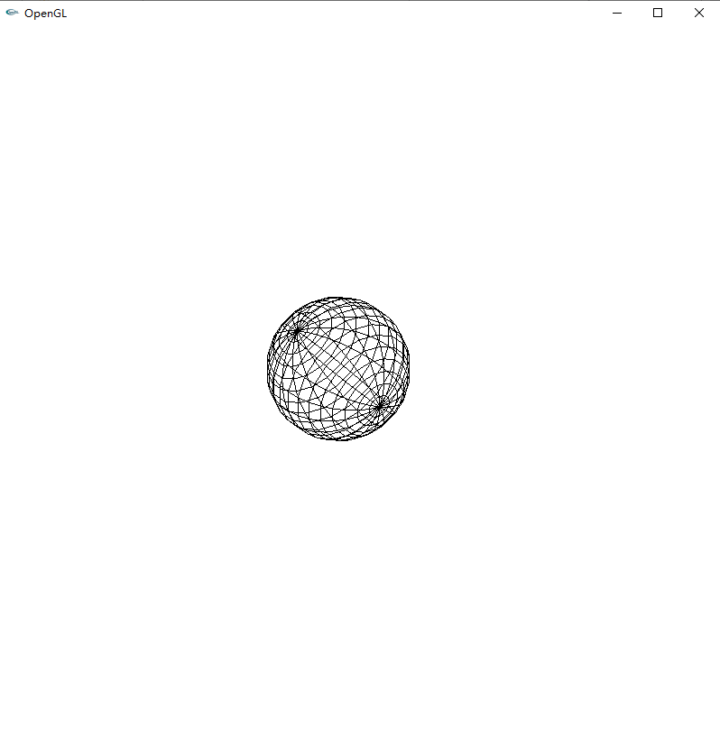
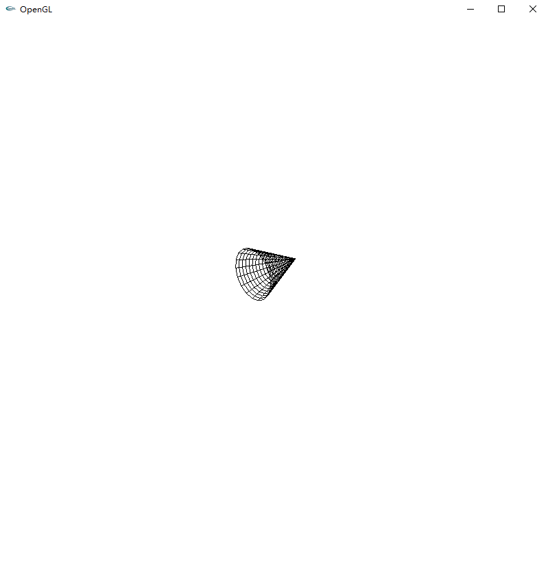
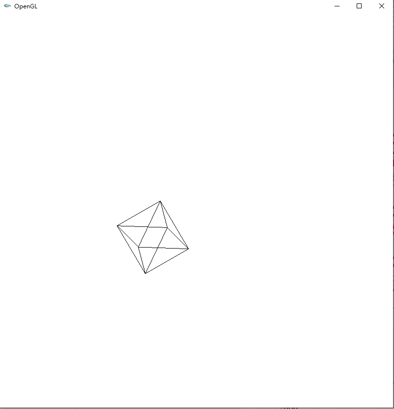
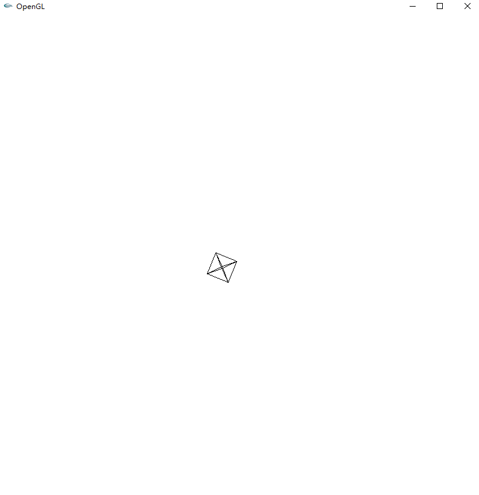
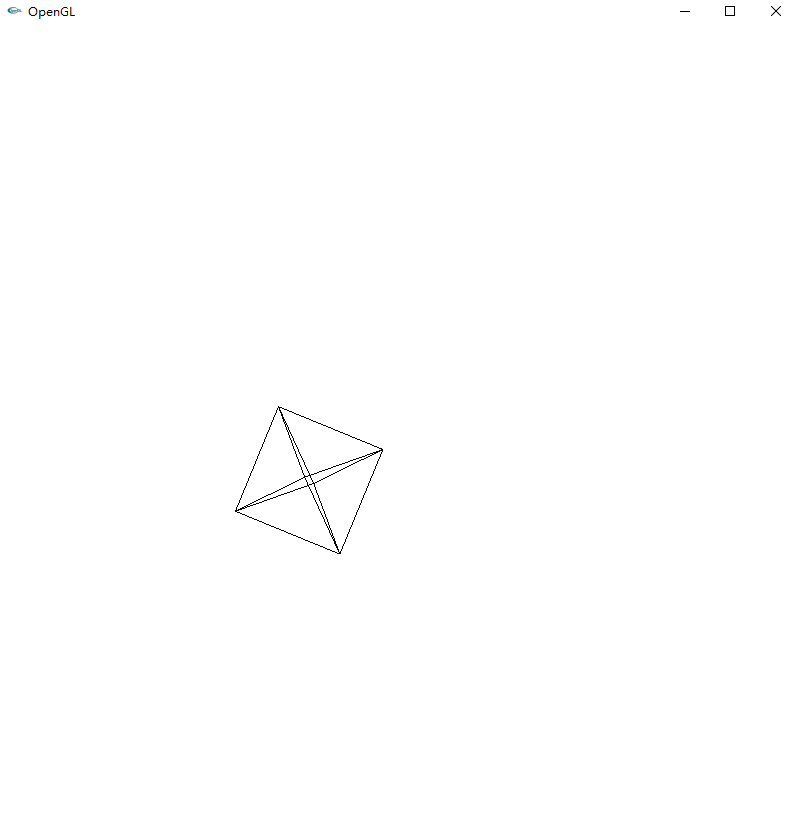
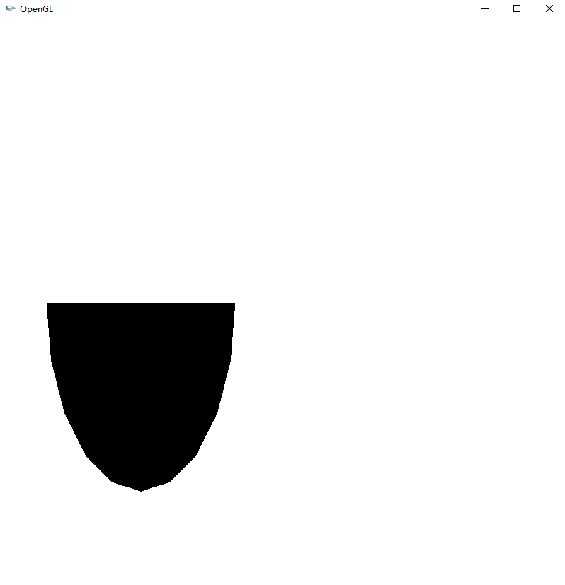

## 计算机图形学 第二次实验

#### 1、使用opengl函数写一个控制台程序，要求输出一些简单的三维图形，包括：球体、圆锥、立方体、茶壶等

代码`GLDraw3D.cpp`:

```c++
/**
 * 绘制三维图形 右键选择框切换绘制茶壶 圆锥 球体等的线图和实体图
 * 可以使用按键和鼠标进行平移 旋转 放缩 视角调整
 * 
 * i j k l键进行旋转
 * w a s d键进行平移 不允许移出窗口
 * - =(+) 键进行图像的缩小和放大 由于观测点的固定 放大过多会导致图形观测不全
 * 鼠标左键拖动视角旋转 为了避免异常的视角 对角度进行了限制 看不全图形时可以进行缩放
 */
```

运行效果：









#### 2、使用opengl函数写一个程序，要求实现对一个图形的平移、旋转和缩放的处理

代码位于`GLDraw3D.cpp`。

运行效果：







#### 3、使用opengl函数写一个控制台程序，要求实现对鼠标、键盘、窗口缩放等事件的处理

主要代码`GLDraw3D.cpp`：

```c++
static int du = 90, oldmy = -1, oldmx = -1;   // du是视点绕y轴的角度 默认y轴是上方向
static double r = 0.5f, h = 0.0f;             // r是视点绕y轴的半径 h是视点高度即在y轴上的坐标
static double hLim = 0.45f;                   // 高度限制
static double radiusPerAngle = M_PI / 180.0f; // 弧度和角度转换参数

/**
 * 鼠标点击事件
 * 
 * @param button 当前鼠标按键
 * @param state 当前鼠标状态
 * @param x 当前鼠标x坐标
 * @param y 当前鼠标y坐标
 */
void Mouse(int button, int state, int x, int y)
{
    if (state == GLUT_DOWN) // 第一次鼠标按下时 记录鼠标在窗口中的初始坐标
        oldmx = x, oldmy = y;
}

/**
 * 鼠标拖动事件
 * 
 * @param x 当前鼠标x坐标
 * @param y 当前鼠标y坐标
 */
void onMouseMove(int x, int y)
{
    du += x - oldmx;          // x轴方向的拖动控制左右旋转
    h += 0.03f * (y - oldmy); // y轴方向的拖动控制上下旋转
    if (h > hLim)
        h = hLim;             // 视点y进行限制 避免异常视角
    else if (h < -hLim)
        h = -hLim;
    oldmx = x, oldmy = y;     // 记录当前鼠标坐标为旧值 准备下一次计算差值
    glutPostRedisplay();
}

// 头朝上从当前视点看原点
    gluLookAt(r * cos(radiusPerAngle * du), h, r * sin(radiusPerAngle * du), 0, 0, 0, 0, 1, 0);
```

==运行效果见可执行文件==`GLDraw3D.exe`。

#### 4、在显示窗口的左下1/4处显示一个球的1/2

主要代码`GLViewHalfSphereLD.cpp`：

```c++
/**
 * 调整窗口大小改变时的图形大小
 * 
 * @param w 当前窗口宽度放缩倍数
 * @param h 当前窗口高度放缩倍数
 */
void ChangeSize(int w, int h)
{
    glViewport(0, 0, w, h);
    glMatrixMode(GL_PROJECTION);
    glLoadIdentity();
    gluOrtho2D(-1.5, 1.5, -1.5, 1.5);
}
```

运行效果：

