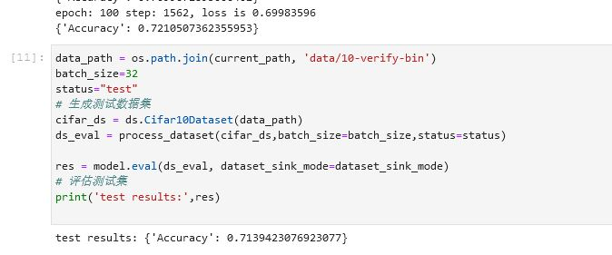
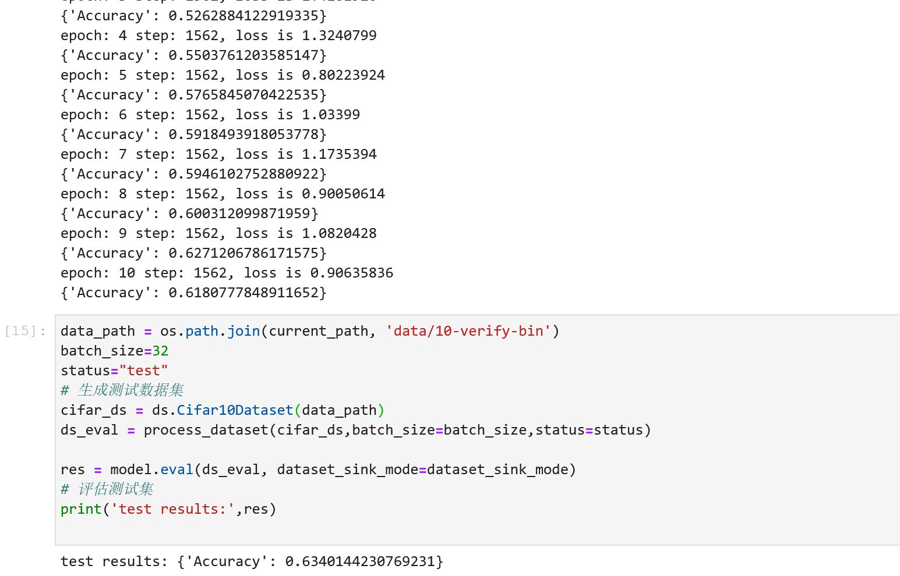
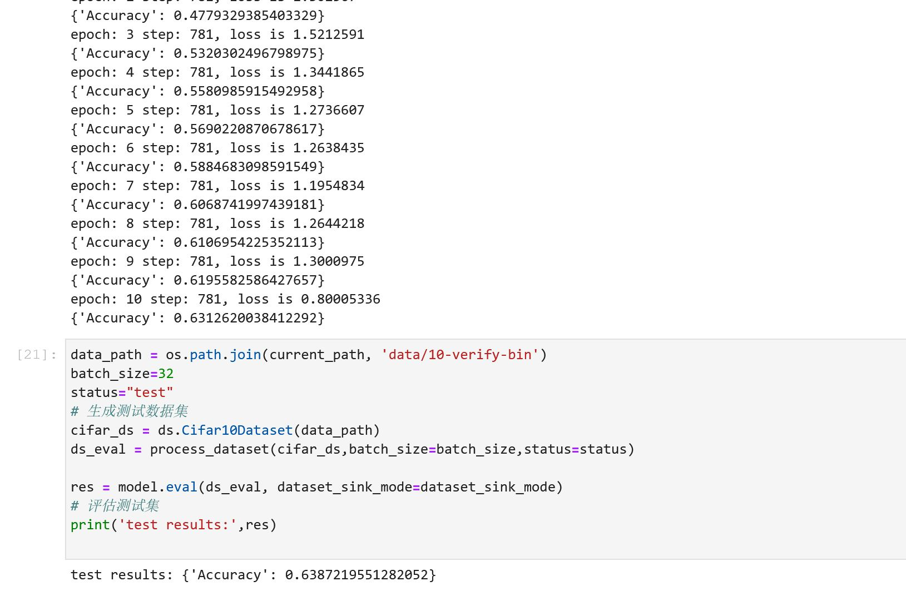
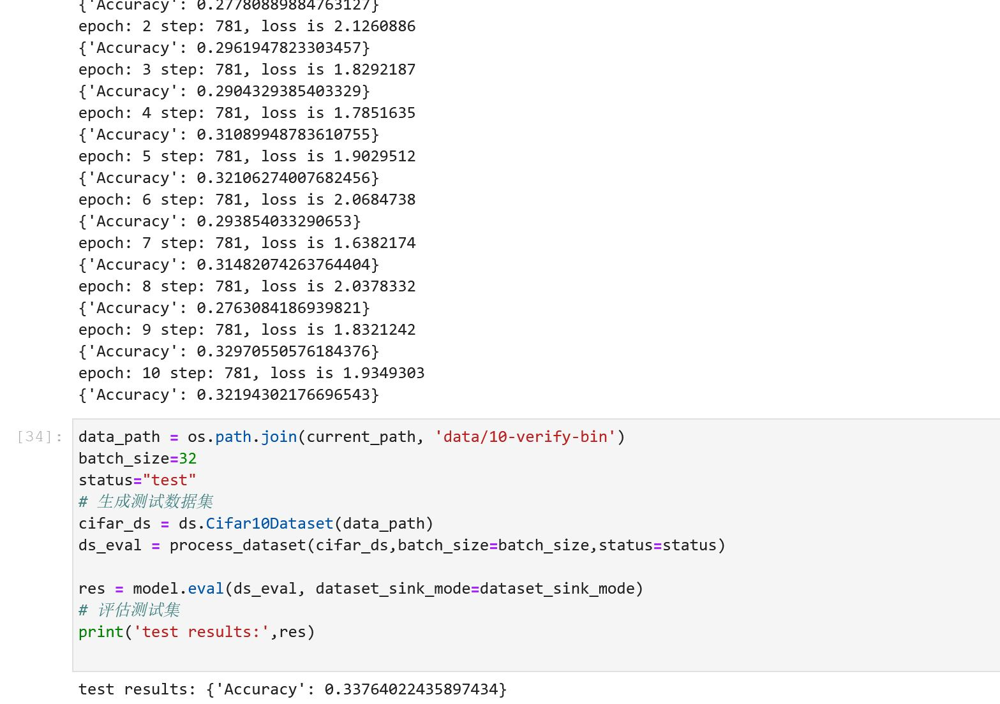
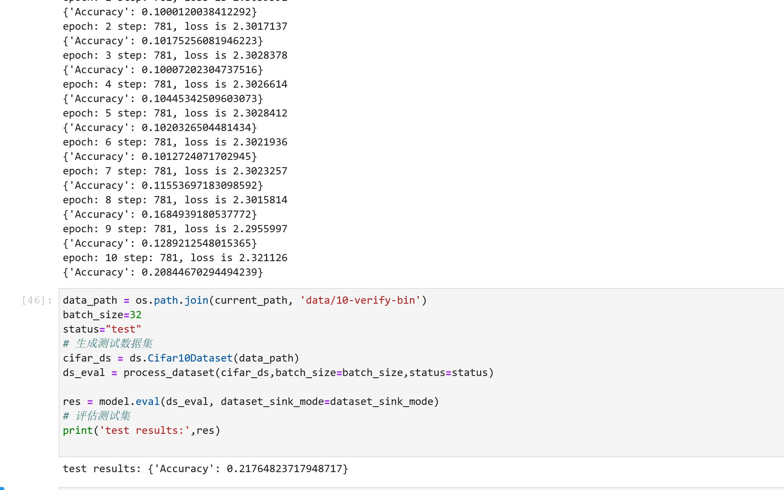
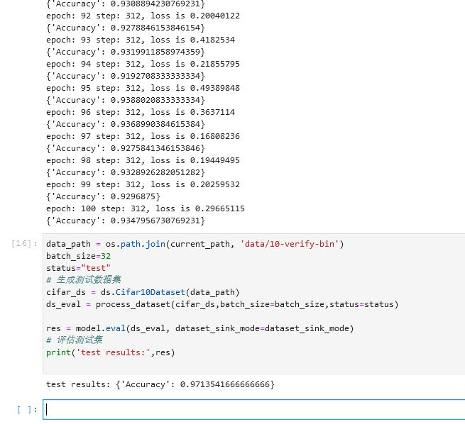

# 计算机视觉 第一次实验

## 任务一 按照华为平台实验手册进行操作

根据手册进行操作：

创建notebook进入jupyter：


查看数据集：


使用手册代码训练Le-Net5：


训练结束：


评估测试：


图片类别预测与可视化：


卷积神经网络训练：


卷积神经网络训练完成并测试：


卷积神经网络图片分类：


## 任务二 LeNet-5模型对比

| 测试结果准确率 | 训练集与测试集比例 | 训练批次大小 | 迭代轮数 | 学习速率 | 最优化方法 | 第i次 |
| :------------: | :----------------: | :----------: | :------: | :------: | :--------: | ----- |
|     0.7139     |        5:1         |      32      |   100    |  0.001   |    Adam    | 1     |
|     0.6340     |        5:1         |      32      |    10    |  0.001   |    Adam    | 2     |
|     0.6387     |        5:1         |      64      |    10    |  0.001   |    Adam    | 3     |
|     0.3376     |        5:1         |      64      |    10    |   0.01   |    Adam    | 4     |
|     0.2176     |        5:1         |      64      |    10    |  0.001   |  Momentum  | 5     |

第1次：



第2次：



第3次：



第4次：



第5次：



**分析**：

- 训练数据和测试数据比例为5:1，实验是分开文件读取的，没有做修改，理论上2:1~4:1挺合理的，本实验一个类有6000张图片，甚至可以把训练集再扩大一点。
- 训练批次大小在本实验中对结果影响不大，理论上batch_size增大有益于提高对相同数据量的处理速度，但过大会导致相同精度所系epoch数量增多。
- 迭代轮数初始为100，效果较10明显更优，但是迭代轮数超过一定范围后首先训练耗时过长，其次模型准确性也不再有明显提高。
- 学习速率在实验中提高一个量级后模型准确率严重降低，理论上学习速率应该设置在一个适当的区间内，过高导致模型不收敛，过小导致模型收敛过慢。
- 最优化方法，实验中用到了两种分别为Adam和Momentum，实验结果没有体现出明显的区别。其中Adam理论上更优，因为它会对学习率进行自适应调整。

## 任务三 卷积神经网络模型设计

```python
class LeNet5_2(nn.Cell):
    """
    Lenet network
    

    Args:
        num_class (int): Num classes. Default: 10.

    Returns:
        Tensor, output tensor
    Examples:
        >>> LeNet(num_class=10)

    """
    def __init__(self, num_class=10, channel=3):
        super(LeNet5_2, self).__init__()
        self.num_class = num_class
        self.conv1_1 = conv(channel, 8, 3)
        self.bn2_1 = nn.BatchNorm2d(num_features=8)
        self.conv1_2 = conv(8, 16, 3)
        self.bn2_2 = nn.BatchNorm2d(num_features=16)        
        self.conv2_1 = conv(16, 32, 3)
        self.bn2_3 = nn.BatchNorm2d(num_features=32)        
        self.conv2_2 = conv(32, 64, 3)
        self.bn2_4 = nn.BatchNorm2d(num_features=64)
        self.fc1 = fc_with_initialize(64*8*8, 120)
        self.bn1_1 = nn.BatchNorm1d(num_features=120)
        self.fc2 = fc_with_initialize(120, 84)
        self.bn1_2 = nn.BatchNorm1d(num_features=84)
        self.fc3 = fc_with_initialize(84, self.num_class)
        self.relu = nn.ReLU()      
        self.max_pool2d = nn.MaxPool2d(kernel_size=2, stride=2)
        self.flatten = nn.Flatten()
        
        

    def construct(self, x):
        x = self.conv1_1(x)
        x = self.bn2_1(x)
        x = self.relu(x)
        x = self.conv1_2(x)
        x = self.bn2_2(x)
        x = self.relu(x)
        x = self.max_pool2d(x)
        x = self.conv2_1(x)
        x = self.bn2_3(x)
        x = self.relu(x)
        x = self.conv2_2(x)
        x = self.bn2_4(x)
        x = self.relu(x)
        x = self.max_pool2d(x)        
        x = self.flatten(x)
        x = self.fc1(x)
        x = self.bn1_1(x)
        x = self.relu(x)
        x = self.fc2(x)
        x = self.bn1_2(x)
        x = self.relu(x)
        x = self.fc3(x)
        return x
```

Le-Net5与卷积神经网络对比：




**分析**：

- BN层用于加快网络的训练和收敛的速度，防止梯度爆炸或梯度消失，防止过拟合
- 实验模型卷积层数为4，全连接层数为3。
- 加了BN层和卷积层数的模型收敛更快并且准确率更高。

