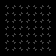
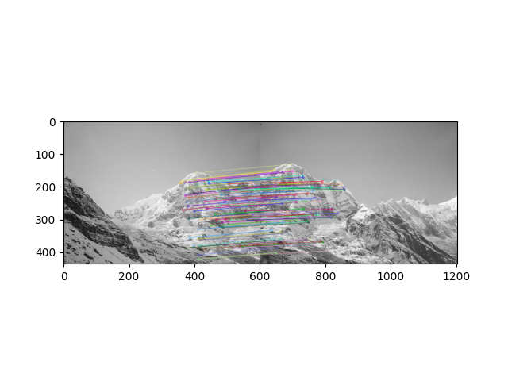

## 计算机视觉 作业2

### 任务一：基本处理Harris角点检测

使用第一次作业的索贝尔算子计算灰度图x和y方向梯度：

```python
def myHarris(filename, savename, sigmax, sigmay, kfactor):
    src = cv2.imread(filename)

    # 转换为灰度图
    gray = cv2.cvtColor(src, cv2.COLOR_RGB2GRAY)

    # 转换为矩阵
    m = np.matrix(gray)

    # 根据索贝尔算子 求x,y的梯度
    delta_h = m
    dx = np.array(grad_x(delta_h, gray))
    dy = np.array(grad_y(delta_h, gray))

    A = dx * dx
    B = dy * dy 
    C = dx * dy

    A1 = A
    B1 = B
    C1 = C

    A1 = cv2.GaussianBlur(A1, (3, 3), sigmax, sigmay)
    B1 = cv2.GaussianBlur(B1, (3, 3), sigmax, sigmay)
    C1 = cv2.GaussianBlur(C1, (3, 3), sigmax, sigmay)

    a = int(gray.shape[0])
    b = int(gray.shape[1])

    final_harris = np.zeros(gray.shape)
    for i in range(a):
        for j in range(b):
            M = [[A1[i, j], C1[i, j]], [C1[i, j], B1[i, j]]]

            final_harris[i,j] = np.linalg.det(M) - kfactor * (np.trace(M)) * (np.trace(M))

    cv2.namedWindow('Harris', cv2.WINDOW_NORMAL)
    cv2.imshow('Harris', final_harris)
    cv2.namedWindow('src', cv2.WINDOW_NORMAL)
    cv2.imshow('src', src)
    cv2.imwrite(savename, final_harris * 255)

    while(True):
        c = cv2.waitKey(1)
        if c == 27:
            break
```

根据角点特征刻画公式计算M矩阵和$E(u, v)$：
$$
E(u,v)=\sum_{x,y}^{}w(x,y)[I(x+u,y+v)-I(x,y)]^2
$$

```python
def myHarris(filename, savename, sigmax, sigmay, kfactor):
    src = cv2.imread(filename)

    # 转换为灰度图
    gray = cv2.cvtColor(src, cv2.COLOR_RGB2GRAY)

    # 转换为矩阵
    m = np.matrix(gray)

    # 根据索贝尔算子 求x,y的梯度
    delta_h = m
    dx = np.array(grad_x(delta_h, gray))
    dy = np.array(grad_y(delta_h, gray))

    # 根据梯度计算 Ix^2 Iy^2 Ix*Iy
    A = dx * dx
    B = dy * dy 
    C = dx * dy

    A1 = A
    B1 = B
    C1 = C

    A1 = cv2.GaussianBlur(A1, (3, 3), sigmax, sigmay)
    B1 = cv2.GaussianBlur(B1, (3, 3), sigmax, sigmay)
    C1 = cv2.GaussianBlur(C1, (3, 3), sigmax, sigmay)

    a = int(gray.shape[0])
    b = int(gray.shape[1])

    final_harris = np.zeros(gray.shape)
    for i in range(a):
        for j in range(b):
            # 从梯度相乘结果得出M矩阵
            M = [[A1[i, j], C1[i, j]], [C1[i, j], B1[i, j]]]

            final_harris[i,j] = np.linalg.det(M) - kfactor * (np.trace(M)) * (np.trace(M))

    cv2.namedWindow('Harris', cv2.WINDOW_NORMAL)
    cv2.imshow('Harris', final_harris)
    cv2.namedWindow('src', cv2.WINDOW_NORMAL)
    cv2.imshow('src', src)
    cv2.imwrite(savename, final_harris * 255)

    while(True):
        c = cv2.waitKey(1)
        if c == 27:
            break
```

结果：



### 任务二：SIFT算法

调库：

```python
import cv2
import matplotlib.pyplot as plt

img1 = cv2.cvtColor(cv2.imread('pics/mountain1.png'), cv2.COLOR_BGR2GRAY)
img2 = cv2.cvtColor(cv2.imread('pics/mountain2.png'), cv2.COLOR_BGR2GRAY)

sift = cv2.xfeatures2d.SIFT_create()

"""
得出关键点和关键点描述子
"""
keypoints_1, descriptors_1 = sift.detectAndCompute(img1, None)
keypoints_2, descriptors_2 = sift.detectAndCompute(img2, None)

bf = cv2.BFMatcher(cv2.NORM_L1, crossCheck=True)    # 建立匹配关系
matches = bf.match(descriptors_1, descriptors_2)    # 匹配描述子
matches = sorted(matches, key=lambda  x:x.distance) # 根据距离排序

img3 = cv2.drawMatches(img1, keypoints_1, img2, keypoints_2, matches[:100], img2, flags=2) # 画出相关特征点

plt.imshow(img3)
plt.show()
```

结果：

