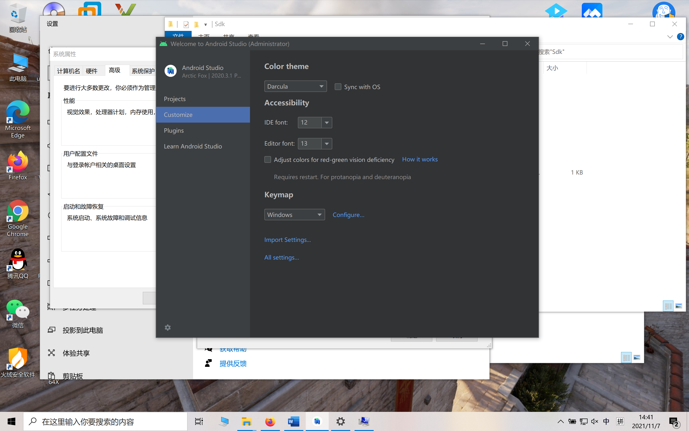

## 软件测试第四次实验-移动测试

### 环境搭建

- Windows10

- Android SDK

  好像现在官方不提供独立的SDK了，于是直接安装Android Studio，使用时自动安装Android SDK

  

- Appium-desktop 1.9.1

- Python 3.7.4

- Appium-Python-Client 1.3.0

- selenium-3.141.0

  

- HarmonyOS 2.0.0 & Appium Setting

  

  通过SDK提供的adb（环境变量配置不知道为啥不管用 直接调exe）控制真机安装安居客：

  

  

  找到需要的应用地址：

  

  

  Json配置与设备名获取：

  

  

  这里根据网上的资料，真机USB测试，鸿蒙2.0.0对应Android 10，设置后连接成功：

  

  

  首页显示：

  

### 安居客测试

主要代码：

```python
def anjukeMobileTest():
    desired_caps = {
      "platformName": "Android",
      "platformVersion": "10",
      "deviceName": "MQS7N19527013421",
      "app": "D:/chlpack-207867-anjuke_15.23.1_322112_b688.apk",
      "appPackage": "com.anjuke.android.app",
      "appActivity": "com.anjuke.android.app.mainmodule.WelcomeActivity",
    }
    # 不要每次测试都重装软件
    desired_caps['noReset'] = True
    # unicode编码
    desired_caps['unicodeKeyboard'] = True
    # 初始化键盘状态
    desired_caps['resetKeyboard'] = True

    # ##################### 1 #####################
    driver = webdriver.Remote(command_executor='http://localhost:4723/wd/hub',
                              desired_capabilities=desired_caps)
    sleep(5) # 刚打开有广告 多等一会
    
    size = driver.get_window_size()
    sleep(3)
    # 先整一堆要用的量 后面拿来滑手势
    x0 = 1
    x0_ = size['width'] * 0.999
    x1 = size['width'] * 0.75
    y1 = size['height'] * 0.25
    x2 = size['width'] * 0.25
    y2 = size['height'] * 0.75
    y3 = 157.0
    y4 = size['height'] * 0.5
    # ......
    # 点击城市选择
    driver.find_element_by_id("com.anjuke.android.app:id/city_name_text_view").click()
    sleep(3)

    # 在输入框输入“南京”
    driver.find_element_by_id("com.anjuke.android.app:id/edittext").send_keys("南京")
    sleep(3)
    # ......
```

- 首先套用Appium的Json配置获取远程websriver，然后获取屏幕宽高，准备后面的手势。然后Appium里面打开应用走一遍，找到所有需要的xpath。
- 然后开始每道题的测试代码单独运行，进行调试，缩短时间，找到诸如有的界面左滑返回只能在中间高度开始、有的按键需要处理弹出框、有的按键需要先滑动页面才能获取等特殊情况进行处理。
- 最后所有题目的代码一起运行，整体测试。

**遇到的问题**：

- 第三题最后一项点击“查看历史”，成功获取element后，无论sleep()多久都无法点进去，测试时开手势可见也确实看见它点了，但是应用没有反应，个人觉得是bug。
- 第四题选择“猜你喜欢”的前两套房源，我登陆进行的测试，它总是主动随机推荐一些东西把要点的遮住了，我试了下滑但还是不能准确点中前两个，所以只能随便点两个往下走。

==最终测试结果视频==在压缩包中。

